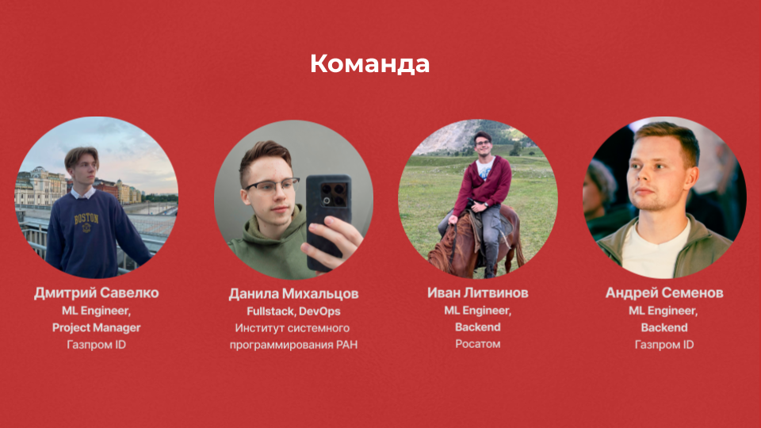
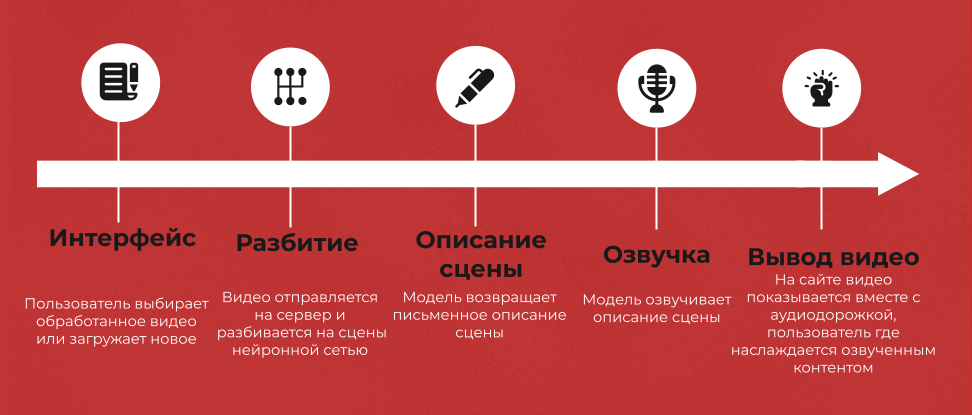
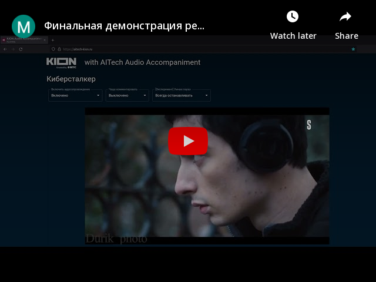

## AITech Audio Accompaniment

Это репозиторий решения команды AITech на MTS True Tech Hack.



\([@ditengm](https://github.com/ditengm), [@m-danya](https://github.com/m-danya), [@litvan007](https://github.com/litvan007), [@In48semenov](https://github.com/In48semenov)\)


Мы участвовали в треке "Аудиосопровождение происходящего на экране для людей с нарушением зрения".
Нужно было сделать инструмент, который поможет людям с нарушениям зрения понимать, что происходит в фильме. Мы разработали и презентовали следующее решение:




Двухминутное видео с демонстрацией решения для очной презентации: 

[](https://youtu.be/qOqBgw-SQ18)


### Визуальное описание бизнес-процесса, сервисов

Визуально представлены на следующих двух схемах


### Предложения по масштабированию

- Улучшение существующей системы остановки видео
- Вставка фонового звука фрагмента фильма поверх озвучки диктора для избежания потери атмосферы фильма
- Лучший подбор гиперпараметров модели и доубучение модели
- Создание рекомендательной системы на основе созданных текстовых описаний

### Как попробовать решение

~~Решение развернуто на [aitech-kion.ru](https://aitech-kion.ru/), заходите!~~

Решение было развернуто на [aitech-kion.ru](https://aitech-kion.ru/) во время хакатона.


### Как запустить локально

Решение полностью упаковано в Docker-контейнеры. Также написан конфиг для docker-compose, позволяющий поднять решение за одну команду из корневого каталога решения:

```bash
docker-compose up --build
```

Сборка может происходить достаточно долго,потому что мы используем несколько тяжеловесных нейросетей. Но это только первый раз, после кэширования зависимостей решение, понятно, будет запускаться моментально.

После окончания сборки решение будет доступно по адресу [http://localhost:1337](http://localhost:1337). Можете проверить и загрузить своё видео без очереди, в отличие от развёрнутого сайта, где в силу ограниченности ресурсов сервера мы сделали последовательную загрузку новых видео. При увеличении количества оперативной памяти и использовании хотя бы простейших видеокарт время обработки видео существенно снизится.

### Dev notes: как деплоили на сервере с использованием SSL-сертификата

Put `fullchain.crt` and `ssl.key` into `web-container/services/nginx`

```bash
docker-compose -f docker-compose.yml -f docker-compose.prod.yml up
```

> Note: `const BACKEND_ADDRESS` is redundant in the frontend. All paths should be relative.
